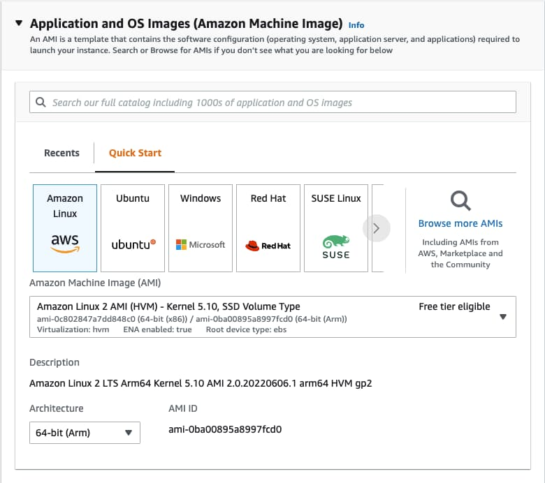
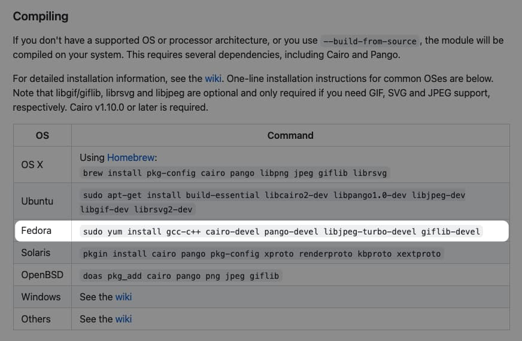

lambda-layer-canvas-fabric-arm64
===

AWS Lambda Layer with [node-canvas](https://www.npmjs.com/package/canvas) and [Fabric](https://www.npmjs.com/package/fabric) included for ARM64 runtime

Do It by Yourself
---

Oh! You want to make your own layer with different version!? Don't worry we got you covered

Create an EC2 instance with **Amazon Linux 2**, you cannot get your node-canvas running if build environment is different from lambda (tl;dr mismatch glibc version)

> Future note: It's possible that you come from the future and Amazon Linux 2 is no longer active runtime for Lambda. Check your current lambda operating system at [AWS Docs](https://docs.aws.amazon.com/lambda/latest/dg/lambda-runtimes.html), if it is [ping me](https://github.com/rayriffy) please and i will try to update docs later



Then, install required dependencies for creating lambda layer by calling a script

```
./initialize.sh
```

If everything goes well, then you're ready to build a layer! Specifying your preferred `canvas`, and `fabric` version in `build.sh` then execute it

```
./build.sh
```

As a final result, you should have `layer.zip` at `dist/` directory. Upload it to Lambda layer, and you should be ready to go.

Using them
---

Just add layer to Lambda function, and you should be able to use them normally

```js
import canvas from 'canvas'
import fabric from 'fabric'

// code below
```

Troubleshooting
---

### 1. Some dependencies are not exist while building canvas

Check [compiling section](https://github.com/Automattic/node-canvas#compiling) of node-canvas repository, try to check that is there some package were addded and initialize command does not have



### 2. It broke my function!

Please make sure that

- You're running lambda function as **arm64**
- Your created EC2 instance is an **arm64** instance
- Node version for your Lambda runtime, and EC2 instance are the same major version

### 3. I want to build with different Node version

Check [this line](initialize.sh#L12-L13) of initizlization. You can change way to install Node here. Just make sure that you're installing **arm64** version of Node, not **amd64**
